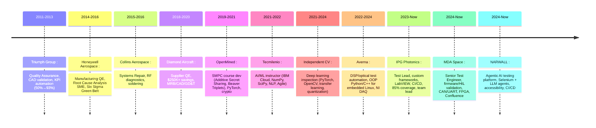

# Carlos Salgado — Senior Software Developer
**Test Automation • Embedded/Firmware/HIL • Agentic AI/Computer Vision**  
Aerospace (MDA Space, Honeywell) → AI-augmented validation systems

## 🎯 Current Focus
- Architecting **agentic AI for HIL test orchestration** (LangGraph, local LLMs)
- Building **computer vision pipelines** for hardware-in-the-loop validation  
- Leading **test automation strategy** for safety-critical embedded systems

## 📊 Key Metrics (from 346 verified bullets)
```
HIL/Embedded Test Coverage    ████████████████████  90% (IPG Photonics)
CI/CD Defect Detection        ██████████████        accelerated (MDA Space)
Agentic Test Gen              ██████████████        autonomous web journeys (NARWALL)
Instrumentation Efficiency    ████████████████      30%+ faster (Averna)
Cost Savings                  ██████████████████    $300K+ verified (Diamond/Honeywell)
LabVIEW Test Coverage         ██████████████████    85% (IPG Photonics)
Automation Coverage           ██████████████████    80% (IPG Photonics)
Quality Trend Improvement     ████████████████████  50%→93% (Triumph)
```

## 🧠 Three-Track Expertise
| Test Automation & Quality | Embedded / Firmware / HIL | Agentic AI / CV / ML |
|---------------------------|---------------------------|----------------------|
| `pytest` `Selenium` `Jenkins` `GitLab CI` `GitHub Actions` `TestRail` | `C/C++` `Embedded Linux` `CAN` `UART` `HIL/SIL` `FPGA` `NI DAQ` | `LangChain` `Ollama` `OpenCV` `RAG` `Multi-Agent` `Transfer Learning` `Quantization` `PyTorch (academic)` |

## 🚀 Flagship Projects (Outcomes-First)
| Project | Track | Outcome | Link |
|---------|-------|---------|------|
| **NARWALL** | Agentic AI + Test | Python-orchestrated LLM agents autonomously explore web apps, surface accessibility issues beyond static scanners; CLI/desktop + API interfaces for CI/CD; deterministic guardrails | [Private — demo on request] |
| **Agentic Accessibility Auditor** | Agentic AI + Test | Selenium + HuggingFace agents for comprehensive web accessibility audits; vision-language models for UX validation | [repo] |
| **CV Defect Detector (SpiritVision)** | CV + Embedded | Deep-learning CV system (PyTorch, OpenCV, transfer learning) for manufacturing quality inspection; model compression/quantization for resource-constrained industrial deployment | [salgadev/spiritvision] |
| **DollyExpertBuilder** | Agentic AI + RAG | 2023 Databricks hackathon; tiny LLM + RAG via LangChain (pre-RAG term); deployed on HuggingFace Spaces; code Q&A expert system | [salgadev/dolly-expert-lite] |
| **DocVerifyRAG** | AI + Docs | GenAI anomaly detection in building docs; LangChain QA + Vectara vector store + Together.ai; Streamlit app | [salgadev/DocVerifyRAG] |
| **Color-UX-Access** | AI + Accessibility | Colorblind accessibility testing via VLM simulation (protanopia/deuteranopia); 2×2 CVD grid; Modal/HF Spaces deployment; GitHub Actions CI | [salgadev/color-ux-access] |
| **HIL Test Harness** | Firmware/HIL | TCP Python testing API; 90% hardware integration test coverage; LabVIEW optical welding control + NI DAQ; custom test automation framework | [repo] |
| **MDA HIL Automation** | Firmware/HIL | Python/Bash test automation in Jenkins CI/CD; CAN bus API testing on aerospace-grade embedded systems; FPGA/Linux validation; Nix reproducible environments | [MDA Space — proprietary] |
| **IPG Test Framework** | Test Auto + Firmware | Architected custom Test Automation Framework (Python, Selenium, LabVIEW); Jenkins-like CI/CD; REST API microservices (MySQL/SQLAlchemy); 85% LabVIEW coverage | [IPG Photonics — proprietary] |

## 🏢 Career Arc


## 📜 Selected Contributions & Recognition
- **OpenMined:** Wrote SMPC lessons (Additive Secret Sharing, Beaver Triplets) — PyTorch, Jupyter, Git
- **Teaching:** Tecmilenio AI courses (2 master's-level); Master's AI course (IBM Cloud, NumPy, SciPy, Python)
- **Certifications:** Six Sigma Green Belt (Honeywell), Root Cause Analysis SME (Honeywell), IBM Applied AI, Quality Engineering (CETYS), ISTQB Foundation (training)
- **Publications:** Medical image processing (Western University MSc thesis, peer-reviewed)
- **Leadership:** 3-dev teams (IPG, MDA); 10-auditor pool (TCS); 8-person project (Colombia Health Ministry)
- **Open Source:** OpenMined repo management (4-person team, PR reviews, issue tracking); LMS contributions

## 📬 Connect
[LinkedIn](https://linkedin.com/in/salgadev) • [Portfolio](https://salgadev.vercel.app) • salgadev@proton.me